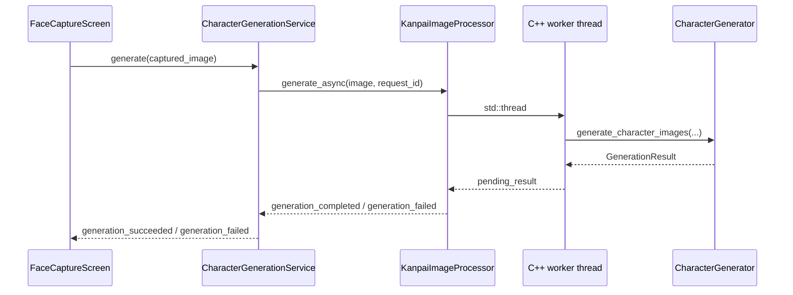

## 処理経路



## CharacterGenerationService

`image_processing/character_generation_service.gd` がGodot側の窓口である。

### Signal

```gdscript
signal generation_succeeded(request_id: int, images: Resource)
signal generation_failed(request_id: int, error_code: int, message: String)
```

### Processor生成

GUI実行では `native_processing_enabled` の初期値がtrue、headless実行ではfalseになる。trueの場合、ClassDBに `KanpaiImageProcessor` が存在すればinstantiateする。

ProcessorをNodeとしてchildへ追加し、`generation_completed` と `generation_failed` を購読する。その後で身体画像、Panel画像、Cascade XMLを読み込み、Processorの `configure()` を呼ぶ。

### 読み込む素材

状態順序はNORMAL、PREPARE、JUDGING、SUCCESS、FAILUREで固定されている。

| State | Body | Panel |
| --- | --- | --- |
| NORMAL | `normal.png` | `default_hair.png` |
| PREPARE | `prepare.png` | `default_hair.png` |
| JUDGING | `judging.png` | `default_hair.png` |
| SUCCESS | `success.png` | `success_overlay.png` |
| FAILURE | `failure.png` | `failure_overlay.png` |

すべて `assets/character_templates/` から読み込む。TextureからImageを取得し、RGBA8以外はRGBA8へ変換する。

顔検出には `assets/character_templates/haarcascade_frontalface_alt.xml` を文字列として読み込む。

### Request管理

Serviceは1から始まるrequest IDを発行する。新規 `generate()` は先に現在requestをcancelし、新しいrequestをactiveにする。

Processorが処理中の場合、新しいrequest IDとImageをpendingとして1件だけ保持する。古いnative requestのcallback後に、pending IDがactive IDと一致すれば開始する。さらに新しい撮影が来た場合、pendingは最新1件で置き換わる。

callbackのrequest IDがactive IDと異なる場合、その結果は画面へemitされない。

`cancel_active_request()` はnative requestへcancelを通知し、Service側のactive ID、pending ID、pending Imageをclearする。native workerの終了待ちは行わない。

### 利用不可時

次のいずれかではdeferred callで `PROCESSING_FAILED` をemitする。

- Processorのconfigureが成功していない。
- Processorがnull。
- 入力Imageがnullまたは空。
- `generate_async()` がfalseを返す。

## GenerationError

C++とGDScriptで同じ整数順序を使用する。

| 値 | 名前 |
| ---: | --- |
| 0 | `NONE` / `None` |
| 1 | `EMPTY_INPUT` / `EmptyInput` |
| 2 | `UNSUPPORTED_PIXEL_FORMAT` / `UnsupportedPixelFormat` |
| 3 | `MISSING_CASCADE` / `MissingCascade` |
| 4 | `INVALID_CASCADE` / `InvalidCascade` |
| 5 | `FACE_NOT_FOUND` / `FaceNotFound` |
| 6 | `MISSING_TEMPLATE` / `MissingTemplate` |
| 7 | `INVALID_TEMPLATE` / `InvalidTemplate` |
| 8 | `CANCELLED` / `Cancelled` |
| 9 | `PROCESSING_FAILED` / `ProcessingFailed` |

## GDExtension API

`addons/kanpai_image/kanpai_image.gdextension` は次のライブラリを登録する。

- macOS debug arm64
- macOS release arm64

`compatibility_minimum` はGodot 4.5、`reloadable` はtrueである。

### KanpaiImageProcessor

Godotへ公開されるmethod:

```text
configure(body_images, panel_images, cascade_xml) -> bool
generate_sync(input_image) -> KanpaiCharacterImageSet
generate_async(input_image, request_id) -> bool
cancel(request_id) -> void
is_generation_in_progress() -> bool
```

Godotへ公開されるSignal:

```text
generation_completed(request_id, images)
generation_failed(request_id, error_code, message)
```

`configure()` は次の条件でfalseを返す。

- workerが処理中。
- BodyまたはPanelのArray要素数が5ではない。
- Cascade XMLが空。
- いずれかのImageを有効なRGB8/RGBA8 bufferへ変換できない。

### KanpaiCharacterImageSet

`Resource` を継承し、次のImage propertyを持つ。

- `normal`
- `prepare`
- `judging`
- `success`
- `failure`

`is_complete()` は5枚すべてが有効かつ空でない場合にtrueを返す。

## 非同期処理

`generate_async()` はGodot ImageをC++の `ImageBuffer` へコピーしてから `std::thread` を開始する。workerは `generate_character_images()` の結果をmutexで保護された `pending_result_` へ保存し、atomic flagを立てる。

Godot main thread上の `_process()` が完了flagを検出し、workerをjoinしてからGodot Resourceへ変換し、Signalをemitする。

`cancel(request_id)` は処理中IDと一致する場合だけatomic cancellation flagをtrueにする。Coreは顔検出前と各状態画像の生成前にこのflagを確認する。

## C++ Core

`native/kanpai_image/src/core/character_generator.cpp` はGodot型を使用しない。入力と出力には `ImageBuffer`、設定には `GenerationConfig`、状態素材には `CharacterTemplateSet` を使う。

### GenerationConfigの初期値

| Property | 値 |
| --- | ---: |
| `output_width` | 628 |
| `output_height` | 1116 |
| `max_input_width` | 1920 |
| `max_input_height` | 1080 |
| `minimum_face_size` | 60 |
| `face_cut_scale` | 1.0 |
| `face_aspect_x` | 0.72 |
| `face_aspect_y` | 0.95 |
| `face_blur_size` | 7 |
| `panel_scale_multiplier` | 0.90 |
| `panel_lift_ratio` | -0.063 |
| `head_width_ratio` | 0.36 |

GDExtensionが状態ごとに設定する角度、横Offset、頭部下端Anchorは次のとおり。

| State | Angle | X offset ratio | Y anchor ratio |
| --- | ---: | ---: | ---: |
| NORMAL | 0° | 0.000 | 0.465 |
| PREPARE | -13° | 0.047 | 0.460 |
| JUDGING | 10° | -0.005 | 0.480 |
| SUCCESS | 0° | 0.019 | 0.480 |
| FAILURE | 0° | 0.019 | 0.450 |

### 生成手順

1. 入力Image、Cascade、出力サイズ、5状態のBody/Panelを検証する。
2. 入力が1920 × 1080を超える場合、aspect比を維持して範囲内へ縮小する。
3. BGRAからGrayへ変換し、Histogramをequalizeする。
4. Haar Cascadeの `detectMultiScale()` で顔を検出する。
5. 複数顔がある場合、面積が最大の矩形を選ぶ。
6. 顔矩形を切り出し、楕円Maskと7px Gaussian blurでalphaを作る。
7. 顔と状態別Panelをalpha合成して頭部画像を作る。
8. 頭部幅を出力幅の36%へresizeする。
9. 状態別角度で回転し、透明余白をtrimする。
10. 状態別X offsetとY anchorでBodyへalpha合成する。
11. 628 × 1116のRGBA8画像を5枚返す。

`detectMultiScale()` のscale factorは1.1、min neighborsは3、minimum sizeは60 × 60である。

顔のMaskは検出矩形中心に作られ、楕円半径は横 `face.width × 0.5 × 0.72`、縦 `face.height × 0.5 × 0.95` である。

Panelは顔幅に対して0.90倍になるようscaleし、顔とPanelの中心を合わせた後、Panel高さの-0.063倍だけy方向へ移動する。現在のPanelは髪・表情等を1枚にまとめた画像として扱われる。

## FaceCaptureScreenでの失敗処理

`FACE_NOT_FOUND` だけは撮影画像をclearし、カメラを再起動してLIVEへ戻る。その他のerror codeは生成失敗Flagを保持し、Review時間終了後に次画面へ進む。その場合、TutorialとMainはGameplayVisualに設定済みの固定Textureを使用する。
