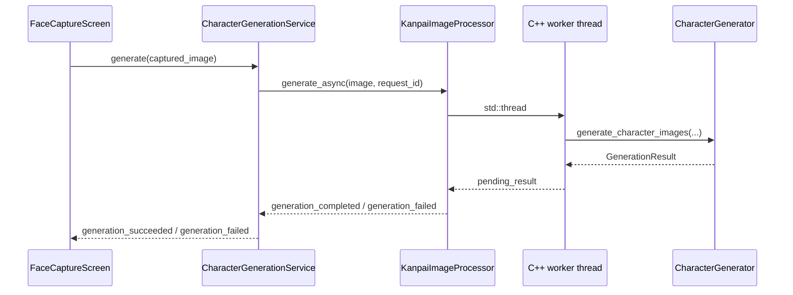

## 処理経路



## CharacterGenerationService

`image_processing/character_generation_service.gd` がGodot側の窓口である。

### Signal

```gdscript
signal generation_succeeded(request_id: int, images: Resource)
signal generation_failed(request_id: int, error_code: int, message: String)
```

### Processor生成

GUI実行では `native_processing_enabled` の初期値がtrue、headless実行ではfalseになる。trueの場合、ClassDBに `KanpaiImageProcessor` が存在すればinstantiateする。

ProcessorをNodeとしてchildへ追加し、`generation_completed` と `generation_failed` を購読する。その後で身体画像、装飾画像、YuNet ONNXを読み込み、Processorの `configure()` を呼ぶ。

### 読み込む素材

Bodyの状態順序はNORMAL、PREPARE、JUDGING、SUCCESS、FAILUREで固定されている。

| State | Body |
| --- | --- |
| NORMAL | `normal.png` |
| PREPARE | `prepare.png` |
| JUDGING | `judging.png` |
| SUCCESS | `success.png` |
| FAILURE | `failure.png` |

装飾素材は次の順序で固定されている。

| Index | File | 適用状態 |
| ---: | --- | --- |
| 0 | `decorations/hair.png` | 全状態 |
| 1 | `decorations/mustache.png` | 全状態 |
| 2 | `decorations/cheeks.png` | SUCCESS |
| 3 | `decorations/failure_mark.png` | FAILURE |

すべて `assets/character_templates/` から読み込む。TextureからImageを取得し、RGBA8以外はRGBA8へ変換する。

顔検出には `assets/character_templates/models/face_detection_yunet_2023mar.onnx` をPackedByteArrayとして読み込む。

### Request管理

Serviceは1から始まるrequest IDを発行する。新規 `generate()` は先に現在requestをcancelし、新しいrequestをactiveにする。

Processorが処理中の場合、新しいrequest IDとImageをpendingとして1件だけ保持する。古いnative requestのcallback後に、pending IDがactive IDと一致すれば開始する。さらに新しい撮影が来た場合、pendingは最新1件で置き換わる。

callbackのrequest IDがactive IDと異なる場合、その結果は画面へemitされない。

`cancel_active_request()` はnative requestへcancelを通知し、Service側のactive ID、pending ID、pending Imageをclearする。native workerの終了待ちは行わない。

### 利用不可時

次のいずれかではdeferred callで `PROCESSING_FAILED` をemitする。

- Processorのconfigureが成功していない。
- Processorがnull。
- 入力Imageがnullまたは空。
- `generate_async()` がfalseを返す。

## GenerationError

C++とGDScriptで同じ整数順序を使用する。

| 値 | 名前 |
| ---: | --- |
| 0 | `NONE` / `None` |
| 1 | `EMPTY_INPUT` / `EmptyInput` |
| 2 | `UNSUPPORTED_PIXEL_FORMAT` / `UnsupportedPixelFormat` |
| 3 | `MISSING_FACE_MODEL` / `MissingFaceModel` |
| 4 | `INVALID_FACE_MODEL` / `InvalidFaceModel` |
| 5 | `FACE_NOT_FOUND` / `FaceNotFound` |
| 6 | `MISSING_TEMPLATE` / `MissingTemplate` |
| 7 | `INVALID_TEMPLATE` / `InvalidTemplate` |
| 8 | `CANCELLED` / `Cancelled` |
| 9 | `PROCESSING_FAILED` / `ProcessingFailed` |

## GDExtension API

`addons/kanpai_image/kanpai_image.gdextension` は次のライブラリを登録する。

- macOS debug arm64
- macOS release arm64

`compatibility_minimum` はGodot 4.5、`reloadable` はtrueである。

### KanpaiImageProcessor

Godotへ公開されるmethod:

```text
configure(body_images, decoration_images, face_detector_model) -> bool
generate_sync(input_image) -> KanpaiCharacterImageSet
generate_async(input_image, request_id) -> bool
cancel(request_id) -> void
is_generation_in_progress() -> bool
```

Godotへ公開されるSignal:

```text
generation_completed(request_id, images)
generation_failed(request_id, error_code, message)
```

`configure()` は次の条件でfalseを返す。

- workerが処理中。
- BodyのArray要素数が5、または装飾のArray要素数が4ではない。
- YuNetモデルのPackedByteArrayが空。
- いずれかのImageを有効なRGB8/RGBA8 bufferへ変換できない。

### KanpaiCharacterImageSet

`Resource` を継承し、次のImage propertyを持つ。

- `normal`
- `prepare`
- `judging`
- `success`
- `failure`

`is_complete()` は5枚すべてが有効かつ空でない場合にtrueを返す。

## 非同期処理

`generate_async()` はGodot ImageをC++の `ImageBuffer` へコピーしてから `std::thread` を開始する。workerは `generate_character_images()` の結果をmutexで保護された `pending_result_` へ保存し、atomic flagを立てる。

Godot main thread上の `_process()` が完了flagを検出し、workerをjoinしてからGodot Resourceへ変換し、Signalをemitする。

`cancel(request_id)` は処理中IDと一致する場合だけatomic cancellation flagをtrueにする。Coreは顔検出前と各状態画像の生成前にこのflagを確認する。

## C++ Core

`native/kanpai_image/src/core/character_generator.cpp` はGodot型を使用しない。入力と出力には `ImageBuffer`、設定には `GenerationConfig`、状態素材には `CharacterTemplateSet` を使う。

### GenerationConfigの初期値

| Property | 値 |
| --- | ---: |
| `output_width` | 628 |
| `output_height` | 1116 |
| `max_input_width` | 1920 |
| `max_input_height` | 1080 |
| `minimum_face_size` | 60 |
| `face_blur_size` | 7 |
| `face_score_threshold` | 0.85 |
| `face_nms_threshold` | 0.3 |
| `hair_width_ratio` | 0.90 |
| `hair_top_ratio` | -0.08 |
| `mustache_mouth_width_multiplier` | 1.65 |
| `mustache_vertical_offset_ratio` | -0.02 |
| `mustache_max_rotation_degrees` | 20.0 |
| `cheeks_width_ratio` | 0.63 |
| `cheeks_top_ratio` | 0.60 |
| `failure_mark_width_ratio` | 0.23 |
| `failure_mark_left_ratio` | 0.68 |
| `failure_mark_top_ratio` | 0.15 |
| `head_width_ratio` | 0.36 |

GDExtensionが状態ごとに設定する角度、横Offset、頭部下端Anchorは次のとおり。

| State | Angle | X offset ratio | Y anchor ratio |
| --- | ---: | ---: | ---: |
| NORMAL | 0° | 0.000 | 0.465 |
| PREPARE | -13° | 0.047 | 0.460 |
| JUDGING | 10° | -0.005 | 0.480 |
| SUCCESS | 0° | 0.019 | 0.480 |
| FAILURE | 0° | 0.019 | 0.450 |

### 生成手順

1. 入力Image、YuNetモデル、出力サイズ、5状態のBody、4枚の装飾を検証する。
2. 入力が1920 × 1080を超える場合、aspect比を維持して範囲内へ縮小する。
3. BGRAからBGRへ変換し、YuNetで顔矩形、両目、鼻先、左右口角を検出する。
4. 複数顔がある場合、minimum size以上で面積が最大の顔を選ぶ。
5. 目・鼻・口角を顔軸として額、頬、顎の輪郭点を作り、Catmull-Rom曲線で補間する。
6. 輪郭を塗りつぶし、7px Gaussian blurでalphaを作って顔を切り抜く。
7. 各装飾の透明余白を除き、顔を基準にresize・配置して頭部画像を作る。ひげは口角間距離から幅、口角中点から中心、口角を結ぶ線から角度を決める。髪とひげは全状態、ほっぺはSUCCESS、失敗マークはFAILUREだけに合成する。
8. 頭部幅を出力幅の36%へresizeする。
9. 状態別角度で回転し、透明余白をtrimする。
10. 状態別X offsetとY anchorでBodyへalpha合成する。
11. 628 × 1116のRGBA8画像を5枚返す。

YuNetのscore thresholdは0.85、NMS thresholdは0.3、minimum face sizeは60 × 60である。

顔のMaskはYuNetの5点から推定した輪郭であり、画素単位で肌境界を検出したセグメンテーション結果ではない。輪郭上側は髪素材で隠れるため、頬から顎の形状を優先している。

装飾位置は検出顔の幅・高さを1.0とする比率で指定する。髪、ひげ、ほっぺは顔の水平方向中央へ配置し、失敗マークだけは左端位置を指定する。装飾は独立して配置されるため、状態固有の表情素材を追加しても髪とひげの大きさ・位置は変化しない。

## FaceCaptureScreenでの失敗処理

`FACE_NOT_FOUND` だけは撮影画像をclearし、カメラを再起動してLIVEへ戻る。その他のerror codeは生成失敗Flagを保持し、Review時間終了後に次画面へ進む。その場合、TutorialとMainはGameplayVisualに設定済みの固定Textureを使用する。
