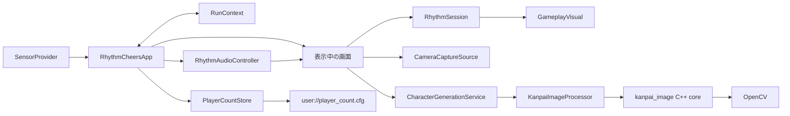
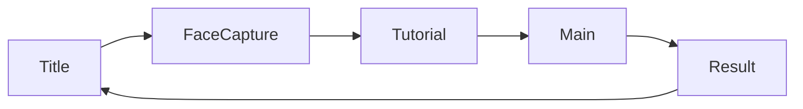

このReferenceは、2026-08-26時点の作業ツリーに存在する実装を記録する。計画、改善案、未実装機能の設計は含めない。

## プロジェクト設定

| 項目 | 現在値 | 定義元 |
| --- | --- | --- |
| Engine feature | Godot 4.6 / Forward Plus | `project.godot` |
| 起動シーン | `res://app/app.tscn` | `project.godot` |
| Viewport | 720 × 1280 | `project.godot` |
| Stretch mode | `canvas_items` | `project.godot` |
| 入力Action | `cheers_input` | `project.godot` |
| キーボード割当 | Space | `project.godot` |
| 正式カメラ対応OS | macOS | `camera/web_camera_capture_source.gd` |
| ネイティブ拡張 | macOS arm64 debug/release | `addons/kanpai_image/kanpai_image.gdextension` |

## 実行時の構成

## 主要コンポーネント

| コンポーネント | 実装場所 | 現在の責務 |
| --- | --- | --- |
| `RhythmCheersApp` | `app/app.gd` | 画面生成、画面遷移、入力配送、`RunContext`所有 |
| `SceneFlow` | `flow/scene_flow.gd` | 画面順序とシーンパス |
| `RunContext` | `flow/run_context.gd` | 1プレイ中に画面間で共有するデータ |
| `PlayerCountStore` | `app/player_count_store.gd` | 端末内の累計体験者数の読込と保存 |
| `FlowScreen` | `screens/flow_screen.gd` | 標準画面の完了Signalと重複完了防止 |
| `SensorProvider` | `sensor/sensor_provider.gd` | 入力元のSignalインターフェース |
| `CameraCaptureSource` | `camera/camera_capture_source.gd` | カメラ状態、Preview、撮影結果のインターフェース |
| `CharacterGenerationService` | `image_processing/character_generation_service.gd` | 画像生成要求、素材読込、非同期要求管理 |
| `KanpaiImageProcessor` | `native/kanpai_image/src/gdextension/` | Godot ImageとC++コアの変換、worker管理 |
| `RhythmChart` | `rhythm/rhythm_chart.gd` | JSON譜面の読込と検証 |
| `RhythmTiming` | `rhythm/rhythm_timing.gd` | 可変BPMの拍と秒の相互変換 |
| `RhythmAudioController` | `rhythm/rhythm_audio_controller.gd` | 画面別OffVocal、掛け声Cue、現在画面の曲時刻 |
| `RhythmSession` | `rhythm/rhythm_session.gd` | 譜面イベント実行と入力判定 |
| `GameplayVisual` | `visual/gameplay_visual.gd` | キャラクター状態、文字演出、横スクロールの表示 |

## 画面順序

画面順序は固定配列 `SceneFlow.FLOW` に定義されている。Resultの次は配列先頭のTitleになる。

## Referenceの構成

- [アプリケーションと画面遷移](./application-flow.md)
- [画面別の動作](./screens.md)
- [入力](./input.md)
- [リズム処理](./rhythm.md)
- [ゲーム画面の描画](./gameplay-visual.md)
- [カメラ](./camera.md)
- [キャラクター画像生成](./character-generation.md)
- [ビルドとテスト](./build-and-tests.md)
