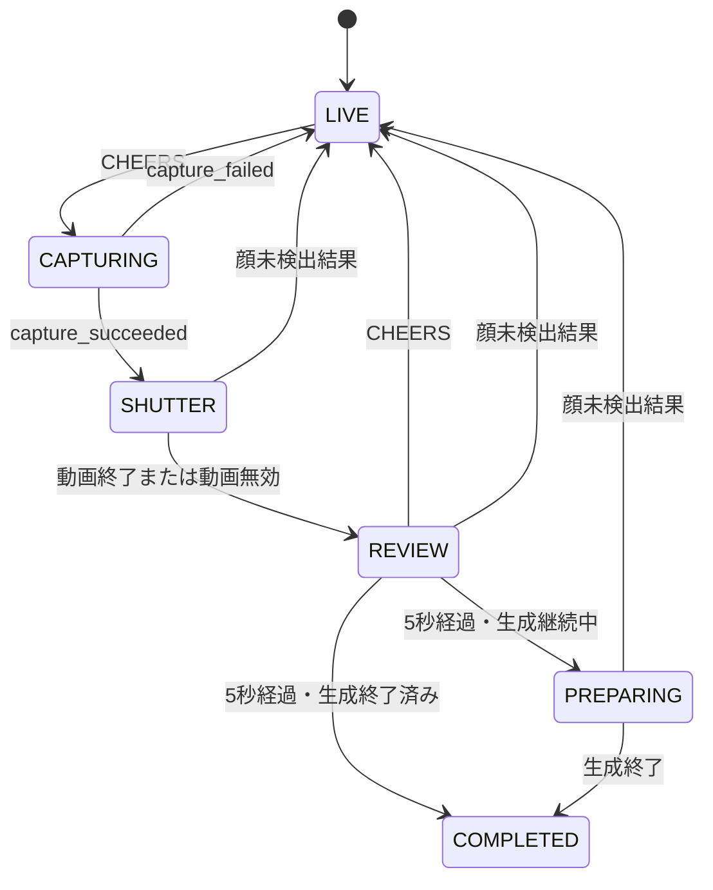

## App共通の開発操作

`app/app.gd` は `Escape` キーを先行して受け取る。タイトル以外の画面で押すと、実行中のリズム音源を停止し、RunContextを破棄してタイトルへ戻る。この操作ではプレイ人数を加算しない。

## Title

実装は `screens/title/title_screen.gd` と `title_screen.tscn` にある。

| Property | 初期値 |
| --- | --- |
| `door_open_duration` | 1.0秒 |
| `door_open_distance_ratio` | 0.5 |

ActionButtonのpressedまたはCHEERS入力で `start_door_opening()` を呼ぶ。処理中は二重実行を拒否し、ActionButtonとLogoを非表示にする。DoorAudioPlayerにstreamがあれば再生する。

Doorは画面幅 × `door_open_distance_ratio` だけ左へ、Quad / Ease In-Outで移動する。Tween完了後に `screen_completed({"door_opened": true})` をemitする。`door_open_duration <= 0` ではTweenを作らず直ちに完了する。

シーンが参照している主なassetは次のとおり。

- `assets/images/title_background.png`
- `assets/images/door.png`
- `assets/images/start.png`
- `assets/images/logo.png`
- `assets/images/goodwil.png`
- `assets/audio/garagara.mp3`

## FaceCapture

実装は `screens/face_capture/face_capture_screen.gd` と `face_capture_screen.tscn` にある。

### Phase

| Phase | 状態 |
| --- | --- |
| `LIVE` | Previewを表示し、撮影入力を受け付ける |
| `CAPTURING` | `capture_frame()` の結果待ち |
| `SHUTTER` | 全画面ShutterPlayerを再生中 |
| `REVIEW` | 撮影画像を表示し、再撮影入力と5秒Timerを受け付ける |
| `PREPARING` | Review時間終了後も画像生成が継続している状態 |
| `COMPLETED` | 次画面への完了Signalを送信済み |

exportの初期値は `review_duration = 5.0`、`shutter_effect_enabled = true` である。

### 初期化

GUI実行では `WebCameraCaptureSource`、headless実行では `FakeCameraCaptureSource` を生成する。テストは `_ready()` より前に任意のCameraCaptureSourceとCharacterGenerationServiceを注入できる。

CameraSourceの次のSignalを購読する。

- `preview_ready`
- `state_changed`
- `capture_succeeded`
- `capture_failed`

CharacterGenerationServiceの次のSignalを購読する。

- `generation_succeeded`
- `generation_failed`

### 撮影から完了まで

撮影成功時は取得Imageをduplicateして `RunContext.captured_face_image` へ保存する。同じImageをCharacterGenerationServiceへ渡し、返されたrequest IDを保持する。Previewは静止画のImageTextureへ差し替え、カメラを停止する。

ShutterPlayerは画面直下にあり、`z_index = 100` で画面全体を覆う。`shutter01.ogv` と `shutter_chroma_key.gdshader` を使用する。撮影要求時にShutterAudioPlayerへstreamがあれば再生する。

REVIEW開始直後の同一入力を再撮影に使わないよう、入力受付はdeferred callで有効になる。REVIEW中にCHEERSを受けると、Review世代番号を更新し、画像生成要求をcancelし、RunContextの撮影・生成データをnullへ戻してカメラを再起動する。

5秒経過時に画像生成中ならPREPARINGへ移る。生成中でなければ `screen_completed({"capture_completed": true})` をemitする。

### 画像生成結果

最新request IDと一致する結果だけを処理する。

| 結果 | RunContext | 画面動作 |
| --- | --- | --- |
| 成功 | ImageSetを保存し成功Flagを設定 | Countdown終了済みなら完了 |
| `FACE_NOT_FOUND` | 生成データと撮影画像をclear | LIVEへ戻りカメラ再起動 |
| その他の失敗 | 生成データをclear | Countdown終了済みなら固定素材のまま完了 |

## Tutorial

実装は `screens/tutorial/tutorial_screen.gd` と `tutorial_screen.tscn` にある。`RhythmSession` と `GameplayVisual` を1つずつ持つ。

| Export | 初期値 |
| --- | --- |
| `chart_path` | `res://rhythm/charts/kanpai_chart.json` |
| `required_success_count` | 3 |
| `intro_display_duration` | 2.5秒 |
| `notice_display_duration` | 1.5秒 |
| `clear_display_duration` | 0.0秒 |
| `music_enabled` | true |

シーンでは代替用の `tutorial_music` に `assets/audio/OffVocal_チュートリアル.mp3` が設定されている。

全曲譜面から `tutorial` Sectionをローカルタイムラインで作成し、1小節目以上16小節目未満のeventを0拍以上60拍未満へ変換してRhythmSessionへ設定する。終了拍は60拍目である。

AppからRhythmAudioControllerが渡された通常フローでは、IntroTimer終了後にTutorial専用音源を0秒から開始する。Controllerがない単独実行ではシーン内のMusicPlayerを使用する。通常フローのBGMとCue音、単独実行時のMusicPlayerはいずれも初期値で+6 dBに設定される。譜面、または代替再生時の音楽がnullの場合はprocessを止め、NoticeLabelへ初期化エラーを表示する。

成功数はTutorial内の `tutorial_success_count` にだけ記録される。`input_resolved` のjudgementが `PERFECT` または `GOOD` のとき、必要数まで加算する。

再生位置が60拍目へ到達すると1回分を終了する。成功数が3未満の場合はControllerまたはMusicPlayerを先頭へ戻して再実行し、2回目以降は「もう一度練習しよう」をNoticeLabelへ表示する。

成功数が3以上の場合はClearOverlayを表示する。現在の `clear_display_duration` は0秒なので、同じ処理内で `screen_completed({"tutorial_completed": true})` をemitする。その後、AppがMain用音源へ切り替える。

RunContextの生成成功Flagがtrueの場合、ImageSetをGameplayVisualへ渡す。falseの場合はシーンに設定された固定Textureを維持する。

## Main

実装は `main/main.gd` と `main/main.tscn` にある。ルートは `Node2D` で、`FlowScreen` は継承していない。

| Export | 初期値 |
| --- | --- |
| `chart_path` | `res://rhythm/charts/kanpai_chart.json` |

シーンのMusicPlayerには単独実行時の代替音源として `assets/audio/OffVocal_本番.mp3` が設定されている。

`_ready()` ではprocessを停止し、全曲譜面から `main` Sectionをローカルタイムラインで作成する。16小節目以上61小節目未満のevent、Cue、BPM変更へ12拍を加え、Sectionの終了拍を192拍にする。RhythmSessionとGameplayVisualをconfigureし、RunContextの生成成功FlagがtrueならImageSetをGameplayVisualへ渡す。RhythmDebugDisplayはsensor mode名 `SHARED` でconfigureされる。

通常フローではMain用に再設定されたRhythmAudioController、単独実行ではMusicPlayerを使用する。どちらもStartOverlayを表示したまま本番音源を0秒から開始する。RhythmAudioControllerのBGMとCue音、単独実行時のMusicPlayerはいずれも初期値で+6 dBに設定される。リードイン終了時刻は `RhythmTiming.beat_to_seconds(chart.lead_in_beats)` で求める。

リードイン中は判定を行わないが、CHEERS入力の手画像は表示する。曲時刻が12拍目へ到達するとStartOverlayを隠して譜面判定を有効にする。そのframeからControllerまたはMusicPlayerの曲時刻をRhythmSession、GameplayVisual、RhythmDebugDisplayへ渡す。本番音源の再生終了時にprocessと音楽を停止し、成功数・失敗数をPayloadへ入れて `screen_completed` をemitする。

## Result

実装は `screens/result/result_screen.gd` と `result_screen.tscn` にある。

画面準備時にRunContextから次を表示する。

| 表示 | 値 |
| --- | --- |
| 成功件数 | `cheers_success_count` |
| 成功金額 | 成功件数 × ¥500 |
| 失敗件数 | `cheers_failure_count` |
| 失敗金額 | 失敗件数 × -¥50 |
| 合計 | 成功金額 + 失敗金額 |
| 累計人数 | `player_number`を3桁ゼロ埋めの「No NNN」として表示 |
| キャラクター画像 | `generated_character_images.normal`から生成したImageTexture |

RunContextがnullの場合、金額と件数は `--` になる。`player_number`が0以下の場合、累計番号は「No ---」になる。キャラクター生成が未成功、画像セットがnull、またはNORMAL画像が空の場合、FacePreviewを空にして「キャラクター画像なし」を表示する。撮影元の`captured_face_image`はResultには表示しない。

`_ready()` で `assets/audio/result.mp3` が設定されていれば再生し、その `finished` signalを受けてMusicPlayerのBGMを開始する。会計音が未設定の場合はBGMを直ちに開始する。

表示開始時はActionButtonを無効化し、CHEERS入力も無視する。`input_accept_delay` の初期値5秒が経過すると両方を有効化する。その後、ActionButtonまたはCHEERS入力で空Payloadの完了Signalをemitし、AppがTitleへ遷移する。
